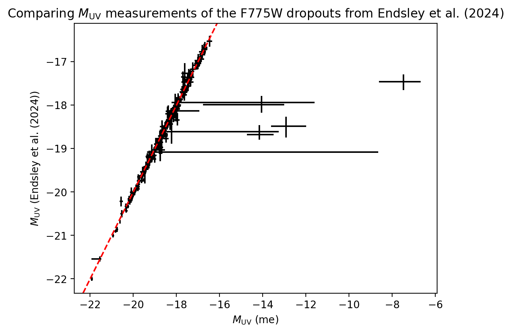

Things to do:

- Compare EWs of galaxies that Ryan directly states
- Check his paper again to confirm our priors are as similar as possible
- Write about possible methodological differences in measuring the EWs from the SEDs
- Calculate the prior EW distributions with different choices for a rest-UV filter
- Could something be biased about calculating the absolute UV magnitudes?
- Reincorporate the ~4 galaxies dropped by BEAGLE
- Systematically compare the BEAGLE properties of the galaxies between Ryan's measurements and my own

# Why aren't the EW distributions identical?

### Different BEAGLE parameter files

### Different filter sets

I confirmed that the filter set that BEAGLE uses (`beagle/filters/filters.dat`) is the exact same filter set as Endsley et al. (2024) states. Perhaps the filter curves could vary slightly (a different wavelength resolution, for example), but that should be completely independent from the observed differences in the inferred EW distributions.

### Different filter choices to evaluate BEAGLE's priors on EWs

An important step when computing the inferred EW distributions is to normalize the "observed" posterior EW distributions from BEAGLE by some prior. This prevents priors from the SED modeling choices from driving any results surmised from the inferred EW distributions. The prior should encode information about the EWs BEAGLE can and does produce when unbiased toward any specific EW. 

In practice, Endsley et al. (2024) calculated the prior EW distributions by fitting BEAGLE to each dropout galaxy, except to just a single photometric band in the rest UV at the targeted redshifts, the brightness of which should deliver no constraining information about the strength of nebular emission lines in the rest optical wavelengths. The resulting prior EW distribution then normalized the posterior EW distribution measured from the full-photometry BEAGLE fit to the galaxy. 

Endsley et al. (2024) does not mention the specific filter they chose to perform that fitting. I chose NIRCam's F200W filter, which lies at some band between $\sim2300-3400$ $\text{\AA}$ for $z = 5.5 - 6.5$ (the approximate redshift band targeted by the selections designed for the F775W dropouts). Endsley et al. (2024) may have chosen a different filter for this operation, however, which could conceivably impact the inferred EW distributions by way of the prior EW distributions. I would expect, though, that the specific choice of rest UV filter should not significantly bias the prior EW distributions. This is computationally testable (but potentially wasteful) by calculating the prior EW distributions with different choices for a rest-UV filter.

#### Open questions:

- How do different choices of the rest-UV filter impact the EW priors?

### Biases in $M_\text{UV}$ measurements

One possibility is that, for some reason, the absolute magnitude $M_\text{UV}$ and EWs are correlated differently, such that not quite the \textit{same} galaxies end up in the different $M_\text{UV}$ bins, shuffling the specific posterior EW distributions in each $M_\text{UV}$ bin. This might be the case, for example, if there are any systematic differences in the rest-UV brightness of the BEAGLE fits. This seems unlikely, though, since, from comparing the photometry of my own fits with the photometry of galaxies that Endsley et al. (2024) also shows, the photometry appears nearly identical.

At any rate, `compare_m_uv.ipynb` produced the below figure, showing, for the objects of the Endsley et al. (2024) F775W dropout catalog, the $M_\text{UV}$ measurements made by Endsley et al. (2024) and my own measurements, using the BEAGLE fits to the photometry of the catalog. It seems a few of my measurements vastly underestimate the $M_\text{UV}$ compared to Endsley et al. (2024), but the two sets of measurements otherwise follow a very tight correlation, as expected. Although key physical parameters might be different, BEAGLE should definitely reproduce the observed brightness and shape of the rest-UV continuum well, at least modulo the redshift, which I suspect is what drives the minimal scatter in the correlation between the two measurements.

I also compared the galaxies in the different $M_\text{UV}$ bins, according to the measurements of Endsley et al. (2024) and my own. With `bins()` in `compare_m_uv.ipynb`, I calculated the number of galaxies in each $M_\text{UV}$ bin for each set of $M_\text{UV}$ measurements, as well as the intersection of the two approaches. Interestingly, based on Endsley et al. (2024)'s measurements, there is one more galaxy in the bright bin, and one fewer galaxy in the very faint bin, than stated in the paper. The two approaches are very similar, though: at most, 22 galaxies shift bins (so $<10\%$ of the sample). The table below summarizes the results.

| | Endsley et al. (2024) (paper) | Endsley et al. (2024) (catalog) | My BEAGLE CSFH fits to the Endsley et al. (2024) catalog | Common to both the Endsley et al. (2024) catalog and my BEAGLE CSFH fits to that catalog |
| :---: | :---: | :---: | :---: | :---: |
| Bright | 64 | 65 | 57 | 57 |
| Faint | 138 | 138 | 135 | 127 |
| Very faint | 76 | 75 | 82 | 72 |

#### Open questions:

- Why do a few of my measurements vastly underestimate $M_\text{UV}$?
- Of the galaxies that shift $M_\text{UV}$ bins, where do they move, and by how much in $M_\text{UV}$?

### Different methodologies for measuring EWs from SEDs

Measuring the EW of an emission or absorption line is a conceptually simple task, but its implementation can vary dramatically (e.g., the integration range or continuum estimation), easily producing systematic differences for the same data. Endsley et al. (2024) does not clarify how they measured the EWs of the key rest-optical nebular emission lines, meaning reproducing identical EWs is significantly more difficult.

My calculation of the EWs happens in the `calculate_ew()` command in `calculate_ew_distribution.ipynb`, which is a wrapper for my custom code to calculate the EWs from the posteriors of a set of BEAGLE fits.

# Galaxies from Ryan's catalog that he directly plots / states properties of in his paper

Figure 5:

1. 32764_GOODSN / JADES-GN+189.19124+62.19952:
redshift: 5.9, 5.67
mass: 327, 251
age: 62, 54
Photometry looks identical

2. 104864_GOODSS / JADES-GS+53.07081-27.70674:
redshift: 6.0, 6.01
mass: 298, 251
age: 41, 47
Photometry looks identical, except maybe one of the filters shortward of the Lyman break (tough to tell since Ryan plots upper limits, not the measurements)

3. 147986_GOODSS / JADES-GS+53.13515-27.77946:
redshift: 6.0, 5.73
mass: 24, 12.6
age: 56, 31
Photometry looks identical, except some scatter in the HST filters shortward of the Lyman break

4. 80873_GOODSS / JADES-GS+53.15167-27.80925:
redshift: 6.0, 5.66
mass: 31, 25
age: 90, 79
Photometry looks identical, even including the discrepancies between the model and observed photometry

Figure 6:

1. 58267_GOODSN / JADES-GN+189.16922+62.23847:
redshift: 5.5, 5.53
mass: 3246, ...
age: 352, 533
Photometry looks identical, including notable discrepancies between the observed and model photometry

2. 30279_GOODSN / JADES-GN+189.27602+62.19577:
redshift: 6.6, 6.16
mass: 1537, ...
age: 470, 460
Photometry looks identical

3. 84049_GOODSS / JADES-GS+53.16401-27.80504:
redshift: 6.1, 5.91
mass: 463, ...
age: 526, 332
The photometry looks identical

4. 93023_GOODSS / JADES-GS+53.20129-27.79351:
redshift: 6.2, 6.13
mass: 369, ...
age: 266, 338
The photometry looks identical

Figure 7:

1. 13782_GOODSN / JADES-GN+189.31721+62.16975:
redshift: 6.0, 5.95
mass: 165, ...
age: 12, 10
The photometry looks nearly identical, apart from a difference in one of the model photometry shortward of the Lyman break

2. 24071_GOODSN / JADES-GN+189.33577+62.18652:
redshift: 6.0, 6.00
mass: 32, ...
age: 5, 5
The photometry looks identical, apart from the flux density in F435W, which is higher in my plot

3. 87234_GOODSS / JADES-GS+53.16900-27.80079:
redshift: 6.4, 6.25
mass: 13, ...
age: 2, 2
The photometry looks identical

4. 147487_GOODSS / JADES-GS+53.17835-27.77879:
redshift: 5.9, 5.73
mass: 7, ...
age: 6, 4
The photometry looks identical, apart from some scatter in the model photometry shortward of the break